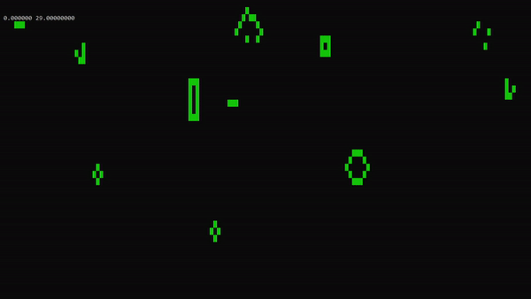

# Conway's Game of Life
An implementation of the popular cellular automaton [Conway's Game of Life](https://en.wikipedia.org/wiki/Conway%27s_Game_of_Life).

Runs natively in the windows console using custom console display library

compiles in visual studio 2019

[space]     - pause simulation  
[left mouse]  - place cell